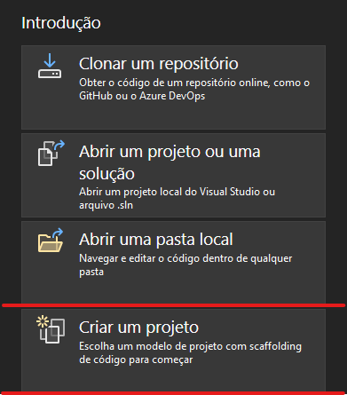

# Template-Worker 
Template para projetos do tipo Worker Service usando as premissas de arquitetura em camadas.Este template foi feito para facilitar o desenvolvimento das novas integrações, dando mais velocidade nas entregas, pois abstrai os conceitos básicos da construção da arquitura proposta, deixando o tempo livre para resolução do negócio da melhor forma.

# IMPORTANTE
Sempre que um projeto é criado a partir do template, suas dependências devem ser atualizadas para que os pacotes usados sejam sempre os mais novos.
O pacote MOQ da camada de testes é o único que **não deve ser atualizado**.

O Arquivo dockerfile é sempre gerado com os projetos das camadas defaults da aplicação, caso seja criada alguma camada adicional ou removida uma existente, deve-se colocar manualmente o caminho no arquivo como mostra a imagem abaixo:


Existe uma nova implementação da execução do worker dentro da classe Base **Worker Base**. Com esta nova implementação, qualquer exceção não tratada gerada, a aplicação vai parar de funcionar. Isso ocorre porquê hoje a tratativa é feita com o probe do Kubernets em conjunto com o healthcheck da aplicação. Caso seja necessário a aplicação se recuperar de exceções não tratadas,uma nova implementação do método ExecuteAsync da Classe **Worker Base** deve ser feita (Usar o bloco try/catch dentro do while) removendo o bloco try/catch externo quem vem implementado.


# Versão 2.0.0

O projeto foi criado na versão 8.0 (LTS) do .Net e contém na versão atual as seguintes features:

1. Configuração do **Serilog** para captura de Logs estruturados.
2. Configuração do Serilog para envio dos logs gerados para o **Application Insights**.
3. Interface e implementação do serviço de logs estruturados.
4. Classe que representa o Log Estruturado.
5. Interface e implementação de serviço de notificação usando a biblioteca - **Flunt**
6. Camada de acesso a dados para uso de MicroOrm dos pacotes **Dapper** ou  **Dapper.Contrib**.
7. Projeto de testes de unidade do tipo **XUnit** configurados para usar as bibliotecas **MOQ,Autofixture**.
8. Extensões de arquitetura para resolução dos arquivos de configurações **(Options Pattern)**.
9. Extensões de arquitetura para resolução de dependência da aplicação.
10. Implementação de Tratamento de resiliência do Retry Pattern usando a biblioteca Polly.
11. Extensão de observabilidade usando Application Insights.**(TelemetryExtensions)**
12. Extensão de observabilidade para track de exceptions customizado no **Application Insights**.
13. Healthcheck customizado para verificação de disponibilidade do worker
14. Estrura de execução via expressão Cron.
15. Adição dos arquivos de **GlobalUsings** em cada camada da aplicação contendo as referências usadas no projeto.
16. Extensão para o tratamento de resiliência usando o Pattern **Retry**. **(ResilienceExtensions)** para chamadas Http.
17. Extensão para tratamento de resiliência usando o Pattern **Retry**. **(DapperResiliencyExtensions)** para acesso a dados usando **Dapper**
18. Arquivo para **diagrama de classes** no domínio da aplicação.

# Extensões

O template provê várias extensões para configurar a aplicação mas nem sempre existe a necessidade de uso de todas.Algumas extensões, trabalham em conjunto com as informações contidas no appSettings.json da aplicação. A adição das extensões é feita sempre dentro do arquivo Program.cs . Algumas extensões tem a necessidade da interface IConfiguration pois precisam das configurações usadas no appSettings.json da aplicação

~~~c#
 IHost host = Host.CreateDefaultBuilder(args)
    .ConfigureServices((hostContext, services) =>
    {
        #region configurações do Worker
        var env = hostContext.HostingEnvironment;

        var config = GetConfiguration(args, env);
        
         services.AddOptionsPattern(config)
                 .AddApplicationInsightsTelemetry(config)
                 .AddWorkerHealthchecks(config)
                 .AddFilterToSystemLogs()
                 .AddAvailabilityService()
                 .AddNotificationControl()
                 .AddDependencyInjectionExtensions()
                 .AddDomain()
                 .AddApplicationServices()
                 .AddInfrastructureData();

        services.Configure<HostOptions>(config.GetSection("HostOptions"));

        #endregion

        services.AddHostedService<Worker>();
    })
    .UseSerilog()
    .Build();

    await host.RunAsync();

~~~

Onde:

* **AddOptionsPattern** => Responsável pelas estruturas de configuração da aplicação.
* **AddApplicationInsightsTelemetry** => Responsável pela observabilidade da aplicação via Application Insights.
* **AddWorkerHealthchecks** => Responsável pelo Healthcheck customizado de disponibilidade.
* **AddFilterToSystemLogs** => Responsável por remover os logs gerados pelo Aspnet Core e outros pacotes da arquitetura.
* **AddAvailabilityService** => Responsável por adicionar o serviço de Disponibilidade da aplicação
* **AddNotificationControl** => Responsável por adicionar o serviço de notificação da aplicação
* **AddDependencyInjectionExtensions** => Responsável pela resolução de dependências estruturais
* **AddDomain** => Responsável pela resolução de dependências criadas na camada de Dominio. (**Usar se necessário, se não houver nenhuma resolução de dependência pode ser removida**)
* **AddApplicationServices** => Responsável pela resolução de dependências criadas na camada de serviços de aplicação.
* **AddInfrastructureData** => Responsável pela resolução de dependências criadas na camada de infraestrutura acesso a dados.

* **AddApiResiliencesPatterns** => Responsável pelo tratamento de resiliência das chamadas externas.(**Usar caso haja chamadas externas na aplicação**)


# Extensões que não contém configuração


**DapperResilencyExtensions**

Esta extensão possbilita o uso da implementação do Pattern **Rety** usando a biblioteca **[Polly]**(https://github.com/App-vNext/Polly) para chamadas a banco de dados.A extensão funciona em conjunto com a classe **SqlServerTransientExceptionDetector** onde estão contidos alguns códigos de SqlErro que serão mapeandos para o uso do Retry de chamadas.É necessário verificar a classe pois caso o SqlErro não esteja mapeando o retry não será executado.A classe pode ser alterada de acordo com a necessidade do projeto.

# Extensões que contém configuração

~~~c#

internal class RepoExemplo(IOptions<BaseConfigurationOptions> options):IRepo
{

    async Task ExecutarAsync(CancellationToken cancellationToken)
    {
        using var conexao = new SqlConnection(options.Value.StringConexaoBancoDeDados);

        var query = "Query que será executada";
        var parametros = new
        {
          valorParametro = "este é um parâmentro"
        };

        await conexao.ExecuteAsyncWithRetry(query,parametros,cancellationToken);
    }

}

~~~

**AddWorkerHealthchecks**

Esta extensão possibilita a adição de um healthcheck para verificação de disponibilidade da aplicação.Para habilitar extensão basta chama-la dentro da classe **Program.cs** usando o objeto **IServiceCollection**. 

~~~c#
IHost host = Host.CreateDefaultBuilder(args)
    .ConfigureServices((hostContext, services) =>
    {
        #region configurações do Worker
        var env = hostContext.HostingEnvironment;

        var config = GetConfiguration(args, env);
        
        services.AddOptionsPattern(config)
                .AddApplicationInsightsTelemetry(config)
                .AddWorkerHealthchecks(config)
                .AddWorkerDependencyInjection()
                .AddDependencyInjectionExtensions()
				        .AddApiResiliencesPatterns(config);
~~~

As seguintes configurações devem ser usadas:

Ambiente de Produção

~~~js
"WorkerHealthchecks": {
    "Port": 8081,
    "UrlPath": "/healthz",
    "Hostname": "*"
  }

~~~

Ambiente de Desenvolvimento

~~~js
"WorkerHealthchecks": {
    "Port": 8081,
    "UrlPath": "/healthz",
    "Hostname": ""
  }

~~~

- Para testes em localhost a url **https://localhost:8081/healthz** deve ser chamada para testar a disponibilidade da aplicação


* Port => Posta da url disponível do healthchek.
* UrlPath => URL  para chamada.
* Hostname => Hostname

<br>

**AddApiResiliencesPatterns**

Esta extensão possibilita um tratamento de resiliência para chamadas externas.Para habilitar extensão basta chama-la dentro da classe **Program.cs** usando o objeto **IServiceCollection**. 

~~~c#
IHost host = Host.CreateDefaultBuilder(args)
    .ConfigureServices((hostContext, services) =>
    {
        #region configurações do Worker
        var env = hostContext.HostingEnvironment;

        var config = GetConfiguration(args, env);
        
        services.AddOptionsPattern(config)
                .AddApplicationInsightsTelemetry(config)
                .AddWorkerDependencyInjection()
                .AddDependencyInjectionExtensions()
				        .AddApiResiliencesPatterns(config);
~~~

As seguintes configurações devem ser usadas

~~~js
 "ResilienceConfiguration": {
    "QuantidadeDeRetentativas": 2,
    "NomeCliente": ""
  }

~~~

* QuantidadeDeRetentativas => Quantidade de retentativas da chamada externa caso dê erro.
* NomeCliente => Nome do cliente Http criado na aplicação.

# IMPORTANTE

**Sempre que a propriedade QuantidadeDeRetentativas estiver com valor 0 , o tratamento de Resiliência não será inserido na aplicação**

**Toda vez que for necessário acessar um serviço externo dentro da aplicação deve-se a adicionar a extensão de resiliência pois ela já tem o HttpService configurado.Caso existem configurações adicionais a serem feitas,deve-se revisitar a implementação desta extensão.** 

<br>
<br> 

**AddAvailabilityServices** 

Esta Extensão possibilita o uso de um serviçoo customizado para track de exceptions da aplicação.Para habilitar extensão basta chama-la dentro da classe **Program.cs** usando o objeto **IServiceCollection**. 

~~~c#
IHost host = Host.CreateDefaultBuilder(args)
    .ConfigureServices((hostContext, services) =>
    {
        #region configurações do Worker
        var env = hostContext.HostingEnvironment;

        var config = GetConfiguration(args, env);
        
        services.AddOptionsPattern(config)
                .AddApplicationInsightsTelemetry(config)
                .AddWorkerDependencyInjection()
                .AddDependencyInjectionExtensions()
				.AddApiResiliencesPatterns(config);
~~~

o Contrato do serviço customizado de disponibilidade é:

~~~c#
  void TrackErrorEvent(Exception exception);
  IOperationHolder<RequestTelemetry> StartOperation();
  Task FlushAsync(CancellationToken cancellationToken);
~~~

onde:

* **TrackErrorEvent** => Efetua o "Tracking" de uma exceção.
* **StartOperation** => Inicia uma operação de telemetria no Application Insights(passar como parâmentro o nome do projeto);
* **FlushAsync** =>  Efetua o "Dispose" do objeto de telemetria do Application Insights.

<br>

# Criação e instalação do Template

O AspNet Core já disponibiliza uma gama de templates fixos mas existe a possibilidade da criação de templates customizados.A criação do template veste-worker seguiu essas configurações. Para a criação do template é necessário efetuar a criação do seu projeto podendo ser solution com múltiplas libraries e classes ou apenas library. Para este template usamos a solução de solution com múltiplos projetos.

O primeiro passo é criação de hieraquia de pastas para a criação do template como mostra a imagem abaixo:


Dentro da pasta  **content* deve ser criado o diretório contendo a aplicação que servirá de template.

# IMPORTANTE 

**Nenhuma atualização deve ser feita dentro da aplicação, apenas cria-la para uso com as camadas e configurações necessárias**

Dentro da pasta da aplicação é necessário criar a pasta **template.config** onde criaremos um arquivo de configuração para o template.


## Arquivo template.json

O arquivo **template.json** é o arquivo usado para configurações do projeto, onde podemos inserir informações sobre o template como autor, descrição, classficações, nomes para instalação e etc para saber mais sobre as propriedades que são obrigatórias para a criação do arquivo , acessar o [link](https://github.com/dotnet/templating/wiki/Reference-for-template.json)

## IMPORTANTE

Para que os projetos contidos na solução sejam reconhecidos, deve-se incluir para cada projeto as tags dentro da propriedade **symbols**.As tags devem começar com o **sufixo include seguido do nome do projeto sem espaços** como mostra o exemplo abaixo.

~~~js
"symbols": {
  "includetest": {
    "type": "parameter",
    "datatype": "bool",
    "defaultValue": "true"
  },
  "includedomain": {
    "type": "parameter",
    "datatype": "bool",
    "defaultValue": "true"
  },
  "includeappplicationservices": {
    "type": "parameter",
    "datatype": "bool",
    "defaultValue": "true"
  }]

  ~~~

  Após a criação do projeto e a adição da pasta template.config,deve-se executar os comandos necessários para a instalação do template.

  No diretório principal do projeto executar o comando 

  `dotnet new install .\`

  


Efetuar a listagem dos templates instalados

`dotnet new -l`

  


## Criação de novo projeto via linha de comando

Logo após a confirmação de que o template foi instalado, já podemos efetuar a criação de uma nova aplicação
usando o comando

`dotnet new veste-worker -n MeuProjeto`

onde :

- **veste-worker** -> alias do template para criação
- **-n** -> significa que um nome será dado ao novo projeto
- **MeuProjeto** -> nome do novo projeto

  


  


Após a instalação, devem-se executar os seguintes passos:

- Remover a pasta template.config
- Criar o arquivo gitignore
- Efetuar o restore do projeto


## Removendo template.config

A remoção da pasta template.config pode ser feita manualmente  ou executando o comando dentro da pasta do projeto.

`rmdir /s /q template.config`

 


  


## Criando o arquivo gitignore

O arquivo gitignore é o responsável por remover alguns arquivos que não são necessários dentros dos repositórios das aplicações.Fora da pasta da aplicação, executar o comando:

`dotnet new gitignore`


 


 

## Efetuando o restore do projeto

Dentro da pasta do projeto, executar o seguinte comando para efetuar o restore do projeto

`dotnet restore`

 

## Criação de novo projeto via IDE Visual Studio 2022

Existe a possibilidade de criação do projeto pela IDE Visual Studio 2022. Abra a sua IDE e clique na opção **Criar um projeto**

 


Na Barra de pesquisa digite **veste-worker** para encontrar o template


 


Insira o nome do projeto a ser criado


 

Escolha os projetos que vão fazer parte da solução ele será criado.


 


## IMPORTANTE

Após a criação do projeto é necessário visitar os arquivos **appsettings.json , appsettings.Development.json (appsettings.staging.json se existir) e a classe LogIntegrationExtensions** para inserir a **chave** do **application insights** da sua jornada. Sem essa chave, a aplicação vai gerar um **exceção não tratada em sua inicialização**

**appsettings.json , appsettings.Development.json**

```js
  "ConnectionStrings": {
    "ApplicationInsights": "INSERIR A CONNECTION STRING DO APPLICATION INSIGHTS DA SUA JORNADA"
  },

```

**LogIntegrationExtensions método ConfigureLog**

```C#
 public static Logger ConfigureLog()
 {
     var telemetryConfiguration = new TelemetryConfiguration
     {
         ConnectionString = "INSERIR A CONNECTION STRING DO APPLICATION INSIGHTS DA SUA JORNADA"
     };

     return new LoggerConfiguration()
   .MinimumLevel.Debug()
   .MinimumLevel.Override("Microsoft", LogEventLevel.Error)
   .MinimumLevel.Override("System", LogEventLevel.Error)
   .MinimumLevel.Override("TinyHealthCheck", LogEventLevel.Error)
   .Enrich.FromLogContext()
   .WriteTo.Console()
   .WriteTo.ApplicationInsights(telemetryConfiguration, TelemetryConverter.Traces)
   .CreateLogger();
 }

```

## Desinstalação do template

Existe a possibilidade da exclusão da instalação do template.Caso haja uma nova versão, deve-se excluir a versão anterior e instalar uma nova versão pois os templates ainda não tem versionamento.Para executar a exclusão do template executar o comando:

`dotnet new uninstall .\`


 


 ### **Guidelines**

- [AutoFixture](https://github.com/AutoFixture/AutoFixture)
- [Dapper-Retry-Extensions](https://github.com/chagasbass/dapper-retry-extensions)
- [Flunt](https://github.com/andrebaltieri/Flunt)
- [Microsoft Learn](https://learn.microsoft.com/pt-br/dotnet/core/tutorials/cli-templates-create-project-template)
- [Microsoft WIKI](https://github.com/dotnet/templating/wiki/Reference-for-template.json)
- [Moq](https://github.com/devlooped/moq)
- [OptionsPattern](https://thiago-chagas.medium.com/a-vida-me-deu-op%C3%A7%C3%B5es-options-pattern-d010f7f337b)
